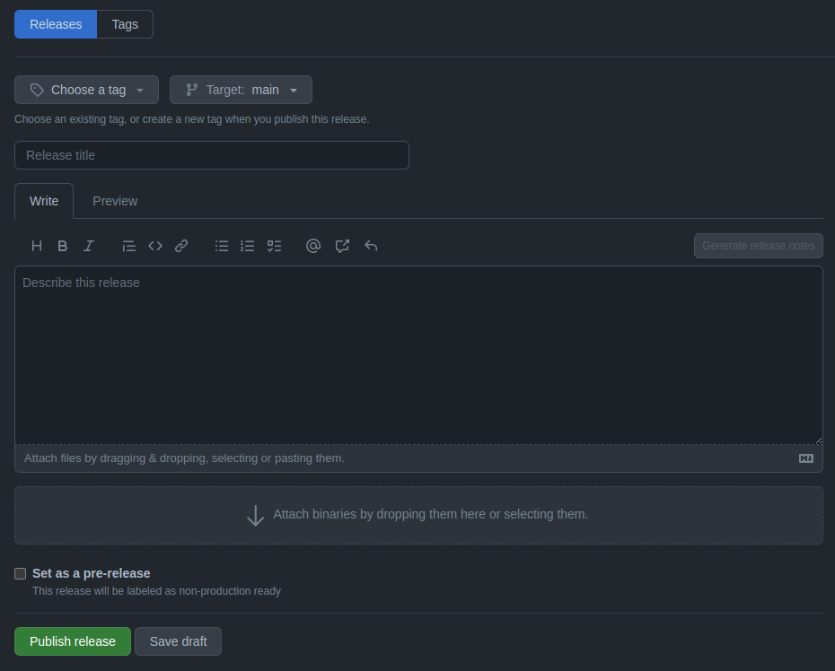
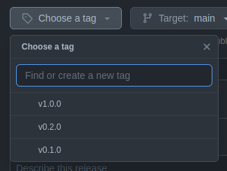

# Release

When a code version is ready, a new release can be published. The idea of this aproach is that once you've generated your code for a particular version, you should never need to touch that version again. This means you never have to worry about breaking changes in any of the branches of the repository, since your old versions are already generated.

??? note "Version name suggestions"

    It’s common practice to prefix your version names with the letter v. Some good tag names might be `v1.0.0` or `v2.3.4`.

    If the tag isn’t meant for production use, add a pre-release version after the version name. Some good pre-release versions might be `v0.2.0-alpha` or `v5.9-beta.3`.

    If you’re new to releasing software, we highly recommend reading about [semantic versioning](https://semver.org/).


## Publishing a new release

To publish a new release you can select `create new relase` option in the repository and fill the release form.



### Step 1: add a tag

You should provide a version ID by creating a new tag or by selecting a tag that has already been created on the `Choose a tag` button.




### Step 2: describe the new release

To describe and specify the features of the new release you can use the next template.

```
# Preamble

This is the first release of the archetype PyTemplate v1.0.0. A cookiecutter archetype to generate a clean base to begin developing data engineer and data science projects.

The current stable state of the project is released knowing a bunch of changes is coming and things to improve.
Future releases will happen more frequently. Stay tuned.


# Features

- CD added with a python-push.yml and GitHub actions
- Logger more detailed
- README.md very detailed

# Minor Changes

- Documentation files added to the main repository


# Bugfixes

- Config file with project name fixed to run the raw template


# Release collaborators

@charlstown 
```