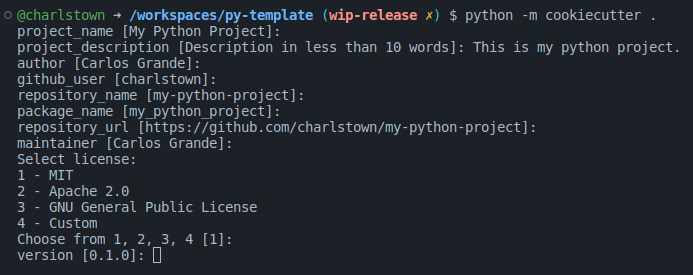

# **User Guide**

This guide will help you to run the project as a user, learn how to get started, set up and use this code.

</br>

# Getting started

## 1. What is cookiecutter

A command-line utility that creates projects from cookiecutters (project templates), e.g. creating a Python package project from a Python package project template.

Visit these links to learn more about cookiecutter.
- Documentation: https://cookiecutter.readthedocs.io/
- GitHub: https://github.com/cookiecutter/cookiecutter


## 2. Installation

To create a new project from the template you need to install cookiecutter and follow these instructions.

## 2.1 Cookiecutter installation

Installing cookiecutter package on Ubuntu is very easy, you can simply run the next command to install it.

```bash
pip install cookiecutter
```

Visit the link to the [cookiecutter documentation](https://cookiecutter.readthedocs.io/en/stable/installation.html#install-cookiecutter) to learn more about the installation.

??? note "Install cookiecutter in a virtual environment"

    It is recommended to create a virtual environment and, install the cookiecutter library inside this environment.


## 2.2 PyTemplate installation

To generate a custom project from the template, follow these steps:

- **Step 1. Create the project:**

    Navigate to the path where you desire to generate the project folder.
    ```bash
    cd /my-projects
    ```
    
    !!! note ""

        There is no need to create a specific folder for your project, cookiecutter will do it for you.

- **Step2. Select the template**
    
    Run the cookiecutter command followed by the template repository URL.
    ```bash
    python -m cookiecutter https://github.com/charlstown/py-template.git
    ```

- **step 3. Customize the template:**

    Fill out the form in the console to customize the template and the project will be generated at the end.

    

Congrats! you finally installed your template to start coding your project. Visit the [Set Up section](/user-guide/set-up/) to learn more about the template generation and the input parameters.

</br>