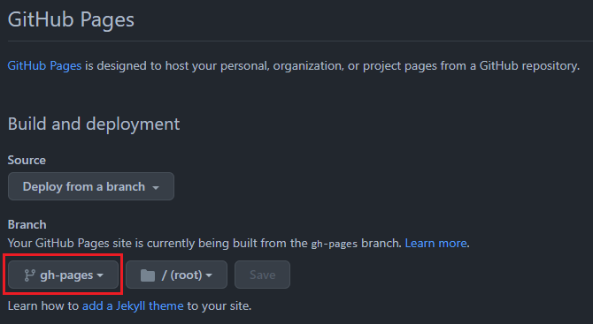

# Getting started

## 1. What is cookiecutter

A command-line utility that creates projects from cookiecutters (project templates), e.g. creating a Python package project from a Python package project template.

Visit these links to learn more about cookiecutter.
- Documentation: https://cookiecutter.readthedocs.io/
- GitHub: https://github.com/cookiecutter/cookiecutter


## 2. Installation

To create a new project from the template you need to install cookiecutter and follow these instructions.

### 2.1 Cookiecutter installation

Installing cookiecutter package on Ubuntu is very easy, you can simply run the next command to install it.

```bash
pip install cookiecutter
```

Visit the link to the [cookiecutter documentation](https://cookiecutter.readthedocs.io/en/stable/installation.html#install-cookiecutter) to learn more about the installation.

??? note "Install cookiecutter in a virtual environment"

    It is recommended to create a virtual environment and, install the cookiecutter library inside this environment.


### 2.2 PyTemplate installation

To generate a custom project from the template, follow these steps:

- **Step 1. Create the project:**

    Navigate to the path where you desire to generate the project folder.
    ```bash
    cd /my-projects
    ```
    
    !!! note ""

        There is no need to create a specific folder for your project, cookiecutter will create the repository folder for you.

- **Step2. Select the template**
    
    Run the cookiecutter command followed by the template repository URL.
    ```bash
    python -m cookiecutter https://github.com/charlstown/py-template.git
    ```

- **Step 3. Customize the template:**

    Fill out the form in the console to customize the template and the project will be generated at the end.

    

You should see a new folder with the repository name you gave as input (`my-python-project`).
Congrats! :fireworks: You finally installed your template to start coding your project!


### 2.3 Adding the project to a new Github repository

- **Step 1. Create a new repository in github:**

    Create the new repository and ==**make sure you give it the same name of the project folder**==, in our case `my-python-project`.
    
    !!! warning

        Don't add any predefined file from github in the new repository, all the files are included in the local project folder.

- **Step 2. Push the local repository:**

    ```
    git remote add origin https://github.com/charlstown/my-python-project.git
    git branch -M main
    git push -u origin main
    ```

    ??? note

        After pushing the project the github action `On Push Deploy Documentation` will create a new branch called `gh-pages`.
        This branch contains the documentation files in html ready to be published in Github Pages.


### 2.4 Deploying the documentation in Github

Deploy your documentation in Github pages is so easy, you only need to set the pages configuration pointing at the `gh-pages` branch generated by our github action `On Push Deploy Documentation`.


!!! warning

    To deploy the documentation in Github Pages the repository must be a public repository.

1. Go to the repository settings.
2. Select `Pages` at the settings menu under the `code and automation` section.
3. Make sure pages is enable and select `gh-pages` as the site branch under `Build and deployment` section.

    

     Your site should be live at: https://charlstown.github.io/my-python-project/


Visit the [Set Up section](/user-guide/set-up/) to learn more about the template generation and the input parameters.

</br>